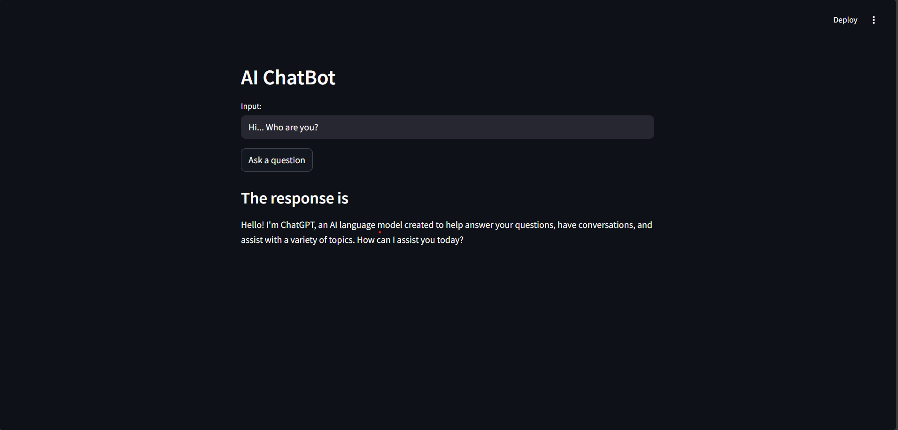

# AI ChatBot 🤖

A simple question-answering chatbot built with **LangChain**, **OpenAI GPT-4**, and **Streamlit**.  
It lets users type a prompt and receive an intelligent response from a compact GPT model, ideal for small-scale use or learning purposes.

> ⚠️ This app is not deployed due to limited API credits. You can run it locally with your own OpenAI API key.

---

## 🖼 Preview



---

## ✨ Features

- Uses `ChatOpenAI` from LangChain to access OpenAI's GPT-4.1-nano model
- Interactive UI built with **Streamlit**
- Secure API key handling using `.env` and `python-dotenv`

---

## 🛠 Requirements

Install dependencies using:

```bash
pip install -r requirements.txt
```

---

## 🔐 Environment Setup

Create a `.env` file in the project root directory:

```env
OPENAI_API_KEY=sk-your-key-here
```

> ✅ `.env` is already excluded from Git via `.gitignore`

---

## 🚀 How to Run

```bash
streamlit run app.py
```

This will open the chatbot app in your default browser.

---

## 📌 Notes

- This project is not deployed due to limited OpenAI API credits
- All code is safe to clone and run locally
- Intended as a practical introduction to building LLM-powered UIs

---

## 📄 License

MIT License 

---

## 🙋‍♂️ Author

**Mudit Mayank Jha**  
GitHub: [github.com/muditjha20](https://github.com/muditjha20)
